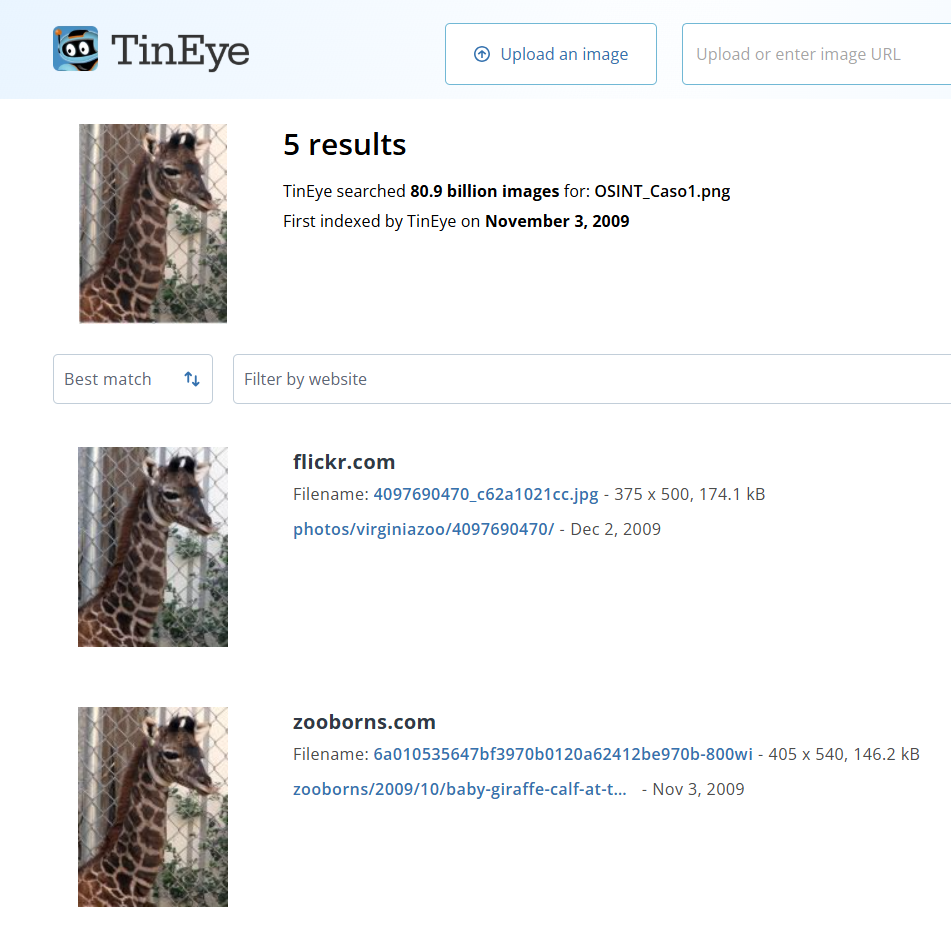
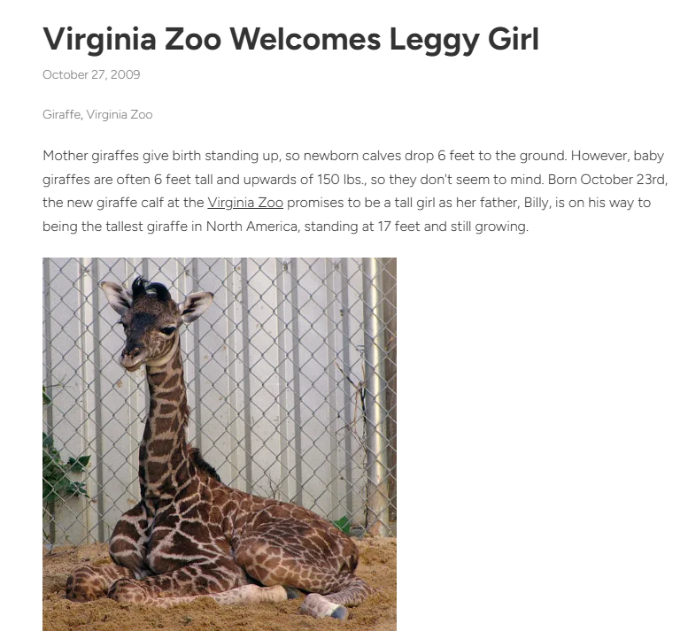
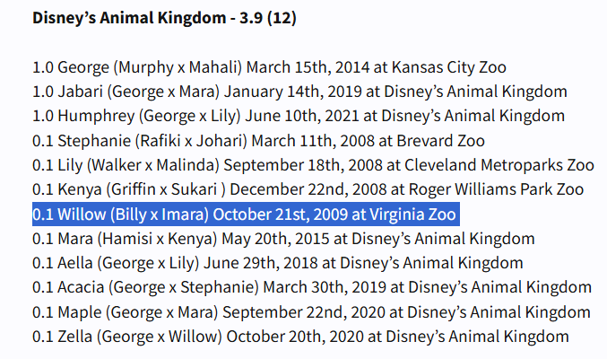
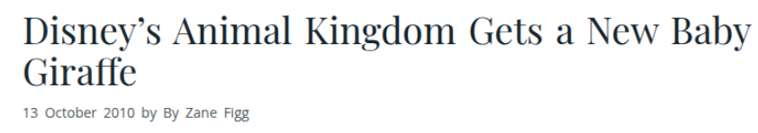
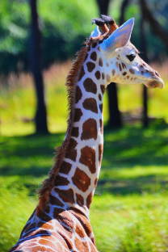

# **Documentación de los casos**

# **Caso 1: Investigación OSINT** 

## **1. Análisis inicial y planificación OSINT**

Objetivo: Identificar lugar/fecha de nacimiento, residencia actual y foto en hábitat actual de la jirafa de la imagen proporcionada.  
Herramientas: Antes de empezar con la investigación planificamos las principales herramientas que vamos a utilizar. Principalmente: Google Imágenes, Google Lens, TinEye, Google Dorks y fuentes abiertas.

Observaciones visuales previas:

* Jirafa bebé con manchas grandes oscuras.  
* Fondo: cerca metálica de cadena, madera, vegetación.

## **2. Recolección de información**

## **Paso 2.1: Búsqueda inversa inicial**

* **Herramienta**: Google Imágenes (images.google.com) y Google Lens.  
* **Procedimiento**: Subida de jirafa\_caso1.jpg.  
* **Resultados**: Imágenes similares genéricas de jirafas bebés en zoos, sin coincidencias exactas ni contexto relevante.

## **Paso 2.2: Búsqueda inversa con TinEye**

* **Herramienta**: TinEye (tineye.com).​  
* **Procedimiento**:  
  1. Accedí a tineye.com.  
  2. Seleccioné "Upload an image" y subí jirafa\_caso1.jpg desde local.  
  3. TinEye procesó la imagen y mostró la primera indexación en 2009\.  
  4. Referencia explícita: "Virginia Zoo 2009" (Norfolk, Virginia, EEUU.).

Comprobamos los diferentes enlaces en tineye de las imagenes. Accedemos al enlace de [zooborns.com](http://zooborns.com). Ya sabíamos que pertenece o podia hacerlo al zoo de Virginia por lo que en la sección de Buscar por especie/zoo buscamos por el zoo de Virginia. También hacemos referencia a la fecha de 2009, que fue la primera indexación de la imagen a tineye por lo cual nos sirve como posible guía.

Lo que vamos a hacer es buscar a través de Control \+ F en las páginas la referencia “2009”. Vamos pasando página por página buscando la referencia hasta que encontramos la noticia en la tercera página con una imagen muy similar a la que se proporciona en el caso.

Aunque en la imagen anterior se muestra que nació el 23 de octubre de 2009, al leer la noticia completa y investigar un poco más, vemos que la fecha correcta se trata de la siguiente:
**a) Lugar y fecha de nacimiento.** Miércoles 21 de Octubre de 2009, 21.15h de la noche. Zoológico de Virginia, Virginia

Sabiendo esta información, seguimos haciendo busquedas en nuestro navegador y con los datos que tenemos accedemos a un foro llamado [zoochat.com](http://zoochat.com) el cual muestra información de los animales que se encuentran en los zoológicos. Filtramos por Jirafa Masai en la zona de Norteamérica y encontramos la siguiente información relevante:

Tras ver que coinciden los datos, nos damos cuenta que se llama Willow y que ahora mismo está en Disney’s Animal Kingdom en Florida.

Hacemos una búsqueda en Google buscando más información sobre Disney’s Animal Kingdom con el nombre de Willow y encontramos la fecha de incorporación a este el 12 de octubre de 2010\.

**b) Residencia actual y fecha de llegada**. Disney’s Animal Kingdom, Florida. 12 de octubre de 2010\.

**c) Fotografía de su hábitat actual.** Buscamos en google “willow giraffe disney animal kingdom” y encontramos fotos actuales de Willow. La siguiente foto pertenece al instagram oficial de Disney.

## Dificultades encontradas

- Las búsquedas iniciales a través de google images y google lens no proporcionan ningún tipo de información que nos sirva para avanzar en la investigación. Al usar la herramienta tineye damos un paso decisivo y empezamos a encontrar indicios relevantes.
- Pequeña confusión en una noticia en la cual informan sobre dos fechas diferentes de nacimiento de Willow. Contrastamos la información a través de más páginas oficiales y más noticias siendo la verdadera el 21oct.
- Identificación ejemplar ambigua: Múltiples jirafas Masai en ZooChat sin nombres específicos. Superamos esta dificultad a través del cruce de información fecha+zoo+nombre (Willow).
- Paginación profunda en Zooborns: Entrada objetivo enterrada en página 3 del blog (cronología inversa). Superado: Ctrl+F sistemático página por página.
- Verificación fecha traslado: Múltiples fuentes contradictorias. Superado: Priorizar noticias oficiales zoo.