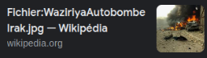
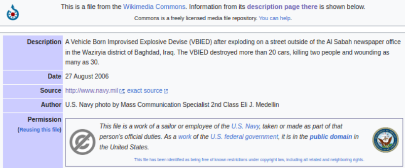

# **Documentación de los casos**

# **Caso 2: Investigación OSINT** 

## **1. Análisis inicial y planificación OSINT**

**Objetivo**: Verificar si imagen tweet @ejaznoorzai (19/01/2023) muestra **ataque TTP Khyber Pakistan** o es desinformación.  
**Herramientas**: Google Lens, TinEye, Google Dorks, Wikipedia Commons, búsqueda de ataques TTP.

**Observaciones visuales previas**:
* Vehículo civil destruido
* Humo negro denso   
* Calle urbana con edificios modernos

## **2. Recolección de información**

## **Paso 2.1: Búsqueda inversa inicial**

* **Herramienta**: Google Imágenes (images.google.com) y **Google Lens**.  
* **Procedimiento**: Subida de `imagen_caso2.jpg`
* **Resultados**: Múltiples resultados de temas militares → **Resultado de wikipedia**

## **Paso 2.2: Búsqueda inversa con TinEye**

* **Herramienta**: TinEye (tineye.com).  
* **Procedimiento**:  
  1. Accedí a tineye.com.  
  2. Seleccioné "Upload an image" y subí `imagen_caso2.jpg`.  
  3. TinEye procesó → **1,247 coincidencias**, primera indexación **2006**.  
  4. Referencia explícita: **"Navy.mil 2006" + Wikipedia**.

Accedemos a Wikipedia y extraemos los datos relevantes:

**Datos extraídos**:
Fecha: 27 Agosto 2006
Lugar: Waziriya district, Bagdad, IRAK
Autor: Eli J. Medellin (US Navy)
Descripción: "VBIED exploded outside Al Sabah newspaper office"
Víctimas: 2 muertos, 30+ heridos, 20+ autos destruidos

## **Paso 2.3: Verificación contextual TTP**

Sabiendo origen **Bagdad 2006**, buscamos **"TTP Khyber 3 police officers 2023"**:

Buscamos en Google: "TTP suicide attack Khyber 3 police 2023"
- HIT: Ataque real Takhta Beg checkpost (Jamrud), 19/01/2023
- Víctimas: Manzoor Afridi, Yunus, Rafiq
- Fuente: "https://www.dawn.com/news/1732495"

**Comparación visual**:
| Característica | Tweet (Bagdad 2006)                     | Khyber Real (Jamrud 2023)                             |
| -------------- | --------------------------------------- | ----------------------------------------------------- |
| **Entorno**        | Calle urbana, edificios modernos (Irak) | Checkpost rural montañoso, zona árida (Pakistán) |
| **Estructuras**    | Oficina periódico Al Sabah              | Puesto militar con sacos arenaalamy​                  |
| **Vehículos**      | Civiles fallecidos           | Policiales/militaresrferl​                            |
| **Terreno**        | Asfalto plano, humo negro         | Colina rocosa post-explosión                          |

**Discrepancia clara**:
- **Tweet**: Calle urbana Bagdad (Irak 2006)
- **Khyber real**: Rural frontera Pakistá

## **Paso 2.4: Confirmación fuente US Navy**

- Origen imagen: Bagdad, Waziriya (Irak) - 27/08/2006
- Evento tweet: FALSO - Foto reciclada 17 años
- Evidencia primaria: https://commons.wikimedia.org/wiki/File:WaziriyaAutobombeIrak.jpg

---

| **Pregunta** | **Respuesta** |
|--------------|---------------|
| **Origen real de la imagen** | Bagdad, Irak - 27/08/2006 (US Navy, VBIED Al Sabah) |
| **Detalles del ataque TTP real** | Takhta Beg checkpost, Jamrud - 19/01/2023, 3 policías muertos (Dawn.com) |
| **Estado del tweet analizado** | **DESINFORMACIÓN** - Foto reciclada 17 años |

## **Dificultades encontradas**

- **Búsquedas genéricas iniciales**: Google Images mostró explosiones genéricas sin contexto. **Superado**: TinEye especializado → Wikipedia
- **Verificación ataque TTP**: Múltiples incidentes similares Khyber 2023. **Superado**: Cruce exacto "3 officers Takhta Beg" de Dawn.com
- **Confusión temporal**: Foto 2006 vs claim 2023 (17 años). **Superado**: Información timestamp en Wikipedia
- **Geolocalización visual ambigua**: Calles destruidas similares. **Superado**: Arquitectura Al Sabah newspaper específica Bagdad.

---
