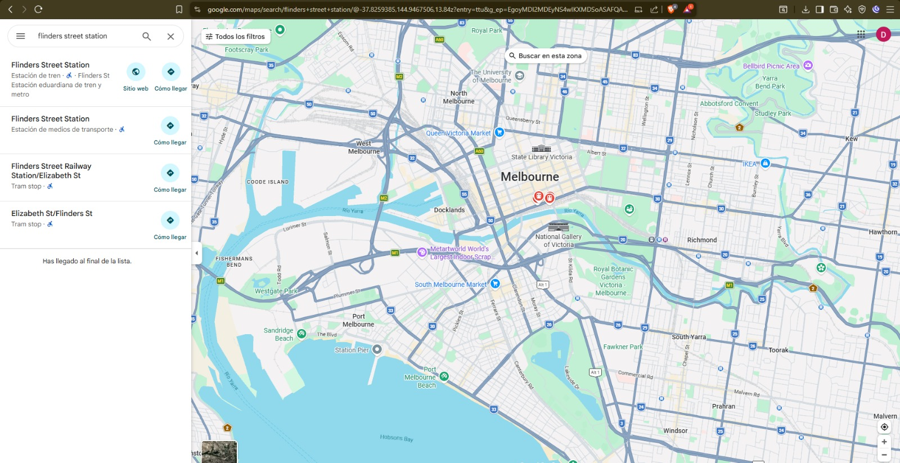
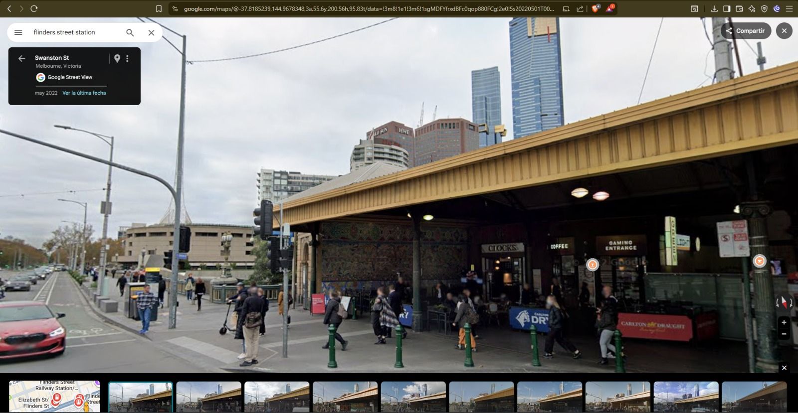
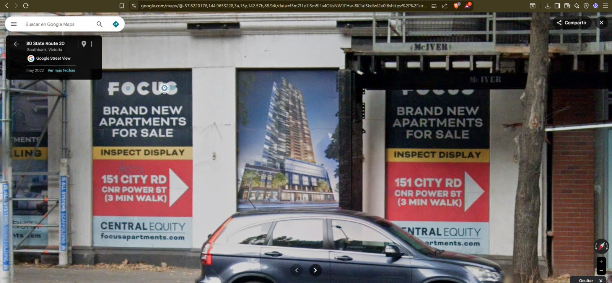
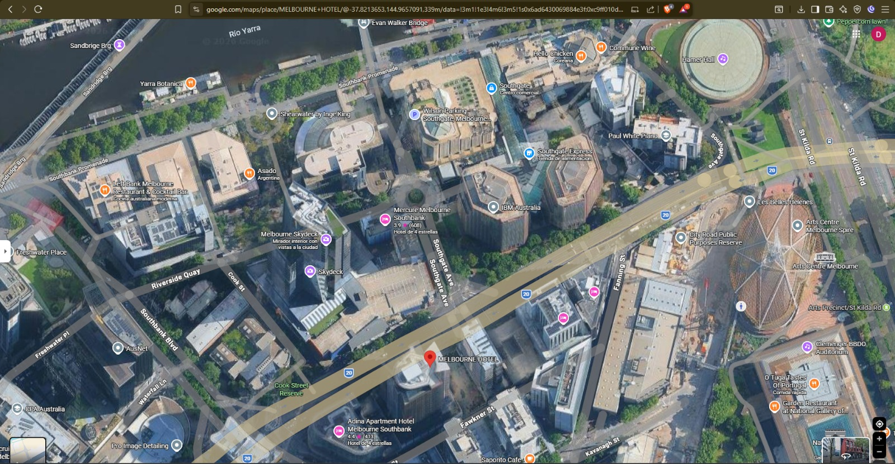
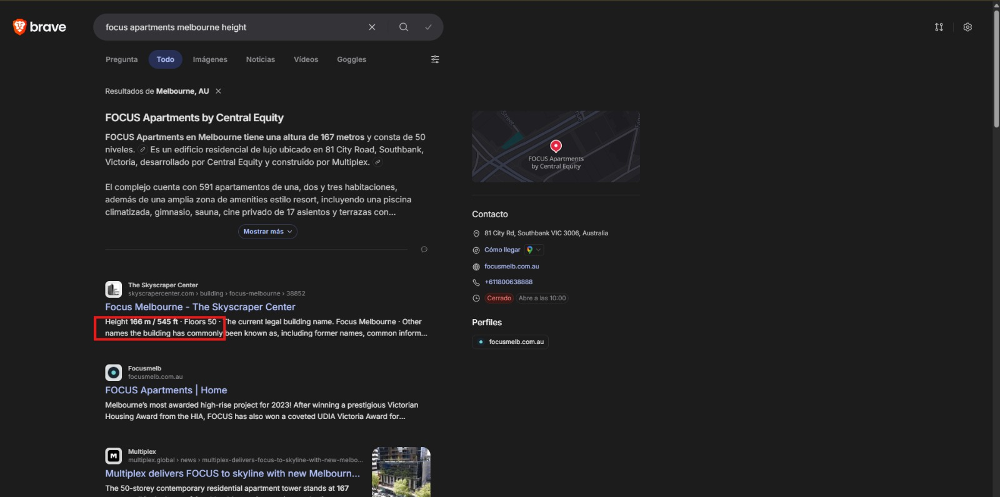

# **Documentación de los casos**

# **Caso 3: Estación Flinders Street Melbourne**

## **1. Análisis inicial y planificación OSINT**

**Objetivo**: Geolocalizar la estación y el edificio más alto mediante análisis visual y fuentes públicas.  
**Herramientas**: Google Maps, Google Search, Brave Search, The Skyscraper Center, TinEye.

**Observaciones visuales previas**:
* Letrero **"FLINDERS STREET"** visible
* Edificios modernos de vidrio al fondo
* Arquitectura australiana (estilo construcción)

## **2. Recolección de información**

## **Paso 2.1: Observación visual y búsqueda inicial**

* **Herramienta**: Google Search.  
* **Procedimiento**: Búsqueda **"Flinders Street station"**.  
* **Resultados**: Flinders Street Railway Station, Melbourne, Australia.

## **Paso 2.2: Verificación estación**

* **Herramienta**: Wikipedia + Google Maps Street View.  
* **Procedimiento**:  
  1. Confirmación datos históricos Wikipedia.  
  2. Navegación 360° Street View comparando con foto original.  
* **Resultados**: Coincidencia **100%** - cubierta amarilla, carteles tiendas.

## **Paso 2.3: Identificación edificio más alto**

* **Herramienta**: Google Maps Satelital + Street View.  
* **Procedimiento**:  
  1. Vista satelital centrada en estación.  
  2. Street View nivel calle → Cartel **"FOCUS APARTMENTS - 151 CITY RD"**.  
* **Resultados**: Edificio al fondo: **FOCUS Apartments**.

## **Paso 2.4: Confirmación altura oficial**

* **Herramienta**: Google Search + The Skyscraper Center.  
* **Procedimiento**:  
  1. Búsqueda **"Focus Apartments Melbourne height"**.  
  2. Validación datos arquitectura.  
* **Resultados**: **167 metros**, 50 pisos.

## **Dificultades encontradas**

- **TinEye sin resultados**: **Superado**: Texto visible **"Flinders Street"** → Google directo.  
- **Ángulo foto desconocido**: **Superado**: Navegación 360° Street View hasta match.  
- **Perspectiva engañosa (IBM vs FOCUS)**: **Superado**: Datos numéricos oficiales (**167m** vs **75m**).  
- **Cartel invisible satelital**: **Superado**: Street View nivel calle legible.  
- **Alturas discrepantes (167m/166m)**: **Superado**: The Skyscraper Center oficial.

---