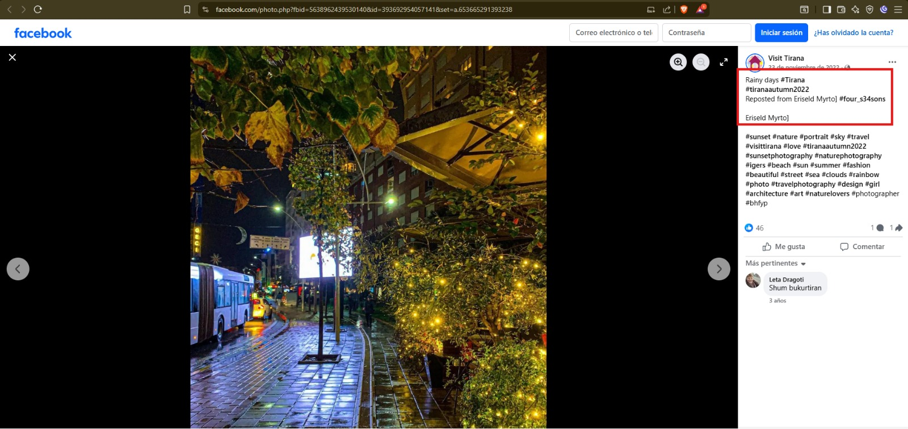
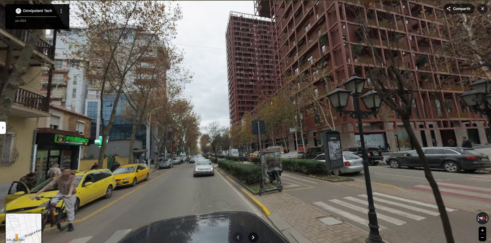
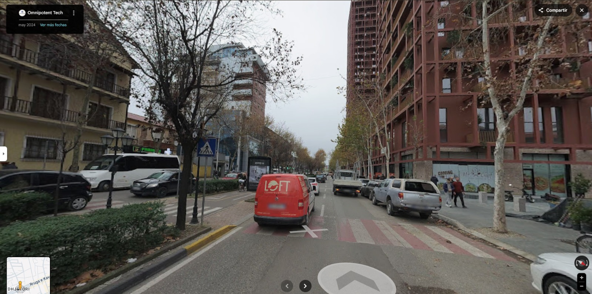

# **Documentación de los casos**

# **Caso 4: Investigación OSINT** 

## **1. Análisis inicial y planificación OSINT**

**Objetivo**: Determinar a qué hora se grabó el vídeo y las coordenadas exactas de dónde caminaba la persona, usando técnicas de geolocalización y cronolocalización.  
**Herramientas**: Twitter/X, Instagram, Google Earth Pro, Google Street View, SunCalc.

**Observaciones visuales previas**:
* Vídeo publicado por **@VisitTirana** el **16 de febrero de 2023**, con el texto **"Sunset in Tirana"**.  
* Calle con un carril en cada dirección y un carril bici/peatonal en el medio.  
* Arbustos verdes y árboles sin hojas a ambos lados, y un edificio distintivo de gran altura visible a la derecha.

## **2. Recolección de información**

## **Paso 2.1: Observación visual y búsqueda inicial**

* **Herramienta**: Twitter/X + Google Search.  
* **Procedimiento**:  
  1. Buscar: **"@VisitTirana Sunset in Tirana"**.  
  2. Localizar el tweet original y su fecha/hora de publicación.  
* **Resultados**:  
  - Tweet publicado el **16 de febrero de 2023 a las 23:07** (11:07 PM).  
  - Descripción: **"Sunset in Tirana"**.  
  - En la imagen del tuit aparece el fotógrafo asociado: **Eriseld Myrto**.
  - Hacemos una búsqueda en google del fotográfo y nos lleva a una página de facebook con esta imagen:

## **Paso 2.2: Verificación hora de grabación**

* **Herramienta**: Instagram + SunCalc.  
* **Procedimiento**:  
  1. Buscar **"eriseld myrto"** en Google.  
  2. Localizar su perfil de Instagram relacionado con @VisitTirana.  
  3. Abrir el vídeo en Instagram y extraer la fecha exacta de subida (haciendo clic en la hora).  
  4. Usar **SunCalc** para comprobar el atardecer en Tirana el 16/02/2023.  
* **Resultados**:  
  - El vídeo en Instagram está publicado el **16 de febrero de 2023 a las 16:48**.  
  - Asumiendo edición mínima, el vídeo se grabó aproximadamente a las **4:45 PM**.  
  - El atardecer real en Tirana ese día fue sobre las 5:30 PM, lo que confirma que la escena coincide con la luz de atardecer.

## **Paso 2.3: Identificación de la calle y edificio distintivo**

* **Herramienta**: Google Earth Pro + Google Street View.  
* **Procedimiento**:  
  1. Observar el vídeo y anotar elementos únicos: carril bici en el centro, arbustos verdes, árboles sin hojas, edificio alto distintivo derecha.  
  2. Explorar Tirana en **Google Earth Pro** usando la vista de edificios 3D.  
  3. Confirmar con **Google Street View** comparando edificios y vegetación.  
* **Resultados**:  
  - La calle identificada es **Kavaja Street (Rruga Kavajë)**, Tirana.  
  - Edificio distintivo: **41°19'36.41"N, 19°48'21.08"E**.

## **Paso 2.4: Confirmación coordenadas inicio y fin del vídeo**

* **Herramienta**: Google Street View Pro + alineación visual.  
* **Procedimiento**:  
  1. Posicionarse en Kavaja Street este del edificio distintivo.  
  2. Alinear farolas, arbustos y señales con primer fotograma (inicio).  
  3. Alinear cartel digital y señal peatonal con último fotograma (fin).  

* **Resultados**:  
  | Pregunta | Respuesta |  
  |----------|-----------|  
  | **Hora grabación** | **~4:45 PM (16:45), 16 feb 2023** |  
  | **Coordenadas inicio** | **41°19'37.24"N, 19°48'27.01"E** |  
  | **Coordenadas fin** | **41°19'36.29"N, 19°48'23.89"E** |

## **Dificultades encontradas**

- **Hora publicación vs grabación**: **Superado**: Instagram Eriseld Myrto muestra 16:48 PM → estimar ~4:45 PM.  
- **Muchas calles similares**: **Superado**: Diseño único Kavaja Street (carril bici centro, arbustos verdes, árboles sin hojas).  
- **Coordenadas exactas**: **Superado**: Google Earth 3D + Street View frame-by-frame (farolas/arbustos).  
- **Street View 2016 vs vídeo 2023**: **Superado**: Elementos permanentes (edificios, estructura calle) idénticos.  
- **Caption "Sunset" engañoso**: **Superado**: SunCalc confirma atardecer 5:30 PM, vídeo previo luz coherente.

---
