# IS-3.d-01 — Investigación y puesta en marcha de MISP + Automatización con PyMISP

**Módulo:** Incidentes de Ciberseguridad  
**Actividad ID:** 3.d-01 

***

## 1. Introducción y Objetivos

MISP (*Malware Information Sharing Platform & Threat Sharing*) es una plataforma de código abierto diseñada para el intercambio de inteligencia sobre amenazas (CTI) entre organizaciones. Permite almacenar, correlacionar y compartir indicadores de compromiso (IOCs) de forma estructurada y estandarizada, facilitando la colaboración entre equipos de respuesta a incidentes (CSIRT/SOC) a nivel global.

Los objetivos de esta práctica son:

- Desplegar una instancia funcional de MISP en entorno local mediante Docker Compose.
- Analizar la arquitectura y el modelo de datos de MISP (Event, Attribute, Object, Galaxy, Tag, Sighting, ShadowAttribute).
- Habilitar y sincronizar el feed público CIRCL OSINT para poblar la base de datos con IOCs reales.
- Automatizar la interacción con MISP mediante la librería PyMISP (API REST en Python).

***

## 2. Arquitectura de MISP

### 2.1 Visión General

MISP sigue una arquitectura cliente-servidor basada en una aplicación web PHP (CakePHP) con los siguientes componentes principales:

| Componente | Función |
|---|---|
| **misp-core** | Aplicación web principal (PHP/Nginx). Gestiona eventos, atributos, feeds y la API REST. |
| **MariaDB** | Base de datos relacional donde se persisten todos los eventos, atributos, usuarios y configuración. |
| **Redis (Valkey)** | Sistema de caché y cola de tareas en background (fetch de feeds, publicación de eventos). |
| **misp-modules** | Servicio de enriquecimiento modular: consultas a VirusTotal, WHOIS, Shodan, etc. |
| **SMTP** | Servidor de correo local para notificaciones y alertas. |

### 2.2 Flujo de Datos

Los IOCs entran en MISP a través de tres vías principales: (1) creación manual por analistas desde la interfaz web, (2) importación automática desde feeds externos configurados, y (3) sincronización con otras instancias MISP a través del protocolo de sincronización propio. Una vez almacenados, los datos se exponen a través de la API REST para su consumo por herramientas externas (SIEMs, EDRs, scripts Python).

### 2.3 Despliegue Docker Compose

El despliegue elegido es Docker Compose, que orquesta todos los contenedores de forma declarativa. Los servicios definidos en `docker-compose.yml` son `misp-core`, `db` (MariaDB), `redis` (Valkey), `misp-modules` y `smtp`.

***

## 3. Instalación con Docker Compose

### 3.1 Clonado del Repositorio Oficial

```bash
git clone https://github.com/MISP/misp-docker.git
cd misp-docker
cp template.env .env
```

El archivo `.env` contiene las variables de entorno del despliegue. Para un entorno local se mantuvieron los valores por defecto. Los múltiples warnings sobre variables no definidas (`SES_USER`, `LDAP_ENABLE`, etc.) son esperados y corresponden a funcionalidades opcionales no utilizadas.

### 3.2 Descarga e Inicio de Servicios

```bash
docker compose pull
docker compose up -d
```

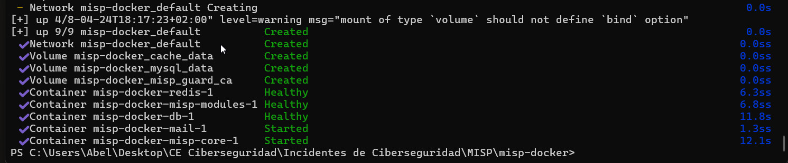

### 3.3 Activación del Modo Live

Tras el primer arranque, MISP se encontraba en modo mantenimiento. Para habilitarlo fue necesario ejecutar el siguiente comando desde la carpeta del proyecto:

```bash
docker compose exec misp-core /bin/bash -c \
  "sudo -u www-data /var/www/MISP/app/Console/cake Admin setSetting 'MISP.live' 1"
```

### 3.4 Acceso Web

Acceso a la interfaz web en `https://localhost` con las credenciales por defecto:

- **Usuario:** `admin@admin.test`
- **Contraseña:** `admin` (cambiada en el primer login)

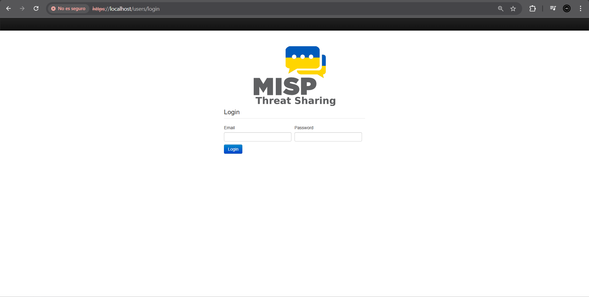

## 4. Modelo de Datos de MISP

MISP organiza la inteligencia de amenazas en un modelo de datos jerárquico compuesto por siete entidades fundamentales. A continuación se documenta cada una:

### 4.1 Event (Evento)

Un **Event** es la unidad principal de información en MISP. Representa un incidente, campaña de malware, vulnerabilidad o cualquier suceso de seguridad relevante. Cada evento agrupa un conjunto de atributos e información contextual relacionada.

Campos principales de un Event:
- **Event ID / UUID**: identificador único del evento.
- **Date**: fecha del incidente o publicación.
- **Threat Level**: nivel de amenaza (`High`, `Medium`, `Low`, `Undefined`).
- **Analysis**: estado del análisis (`Initial`, `Ongoing`, `Completed`).
- **Distribution**: nivel de distribución (quién puede verlo).
- **Published**: si el evento ha sido publicado para compartir.

*Ejemplo real observado:* Evento ID 12 — "OSINT - Packrat: Seven Years of a South American Threat Actor", fecha 2015-12-09, Threat Level Medium, 154 atributos, publicado por CIRCL.


### 4.2 Attribute (Atributo)

Un **Attribute** es la unidad atómica de información dentro de un evento. Representa un IOC concreto o un dato técnico. Cada atributo tiene un tipo (`ip-dst`, `domain`, `sha256`, `url`...) y una categoría (`Network activity`, `Payload delivery`, `External analysis`...).

El campo **`to_ids`** (for IDS) es especialmente relevante: cuando está activo, indica que ese IOC debe ser exportado a sistemas de detección (IDS, firewalls, EDR). 

*Ejemplo práctico:* Se añadió manualmente el atributo `ip-dst = 185.220.101.50` con `to_ids = true` al evento de prueba.

### 4.3 Object (Objeto)

Un **Object** agrupa varios atributos relacionados usando una plantilla predefinida, añadiendo semántica y relaciones entre ellos. En lugar de atributos sueltos, un objeto `domain-ip` agrupa el dominio y su IP de resolución como una unidad lógica.

MISP incluye **388 plantillas de objetos** predefinidas en la instalación analizada, organizadas por meta-categoría (network, file, misc, vulnerability, marine...).

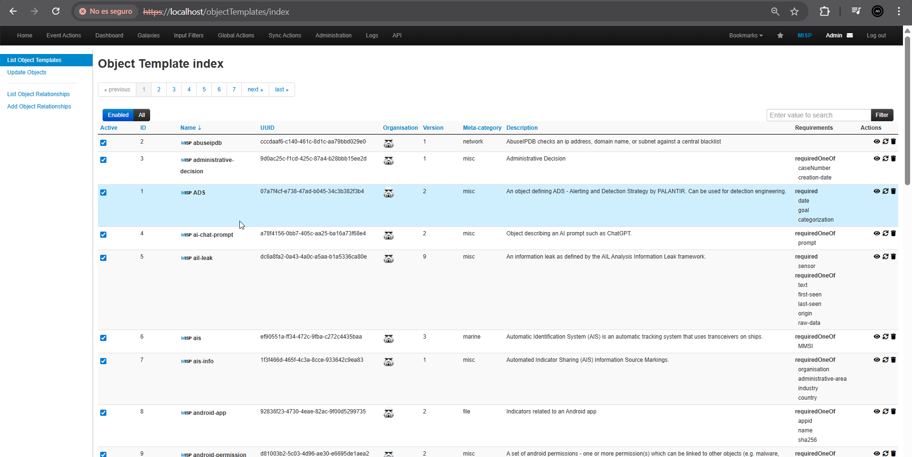

En la siguiente imagen vemos el ejemplo de la plantilla de Attacker-infra:

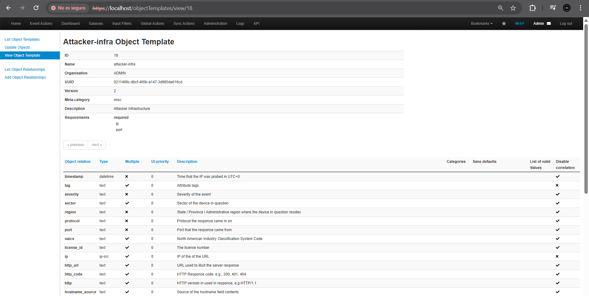

*Ejemplo práctico:* Se creó el objeto `domain-ip` con los valores `domain: malware-c2.com` e `ip-dst: 185.220.101.50`, asociados al evento de prueba.

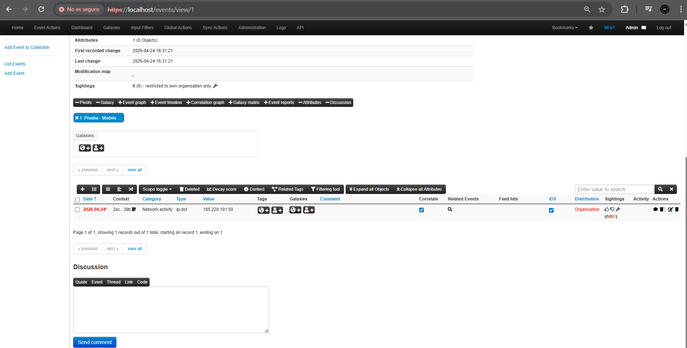

### 4.4 Galaxy (Galaxia)

Las **Galaxies** son bases de conocimiento estructurado que permiten contextualizar los eventos con marcos de amenazas establecidos. Cada galaxia contiene **clusters** (elementos concretos). Las más relevantes para ciberseguridad son:

- `mitre-attack-pattern`: técnicas del framework MITRE ATT&CK.
- `threat-actor`: actores de amenaza conocidos (APTs, grupos criminales).
- `ransomware`: familias de ransomware documentadas.
- `country`: países asociados a amenazas.

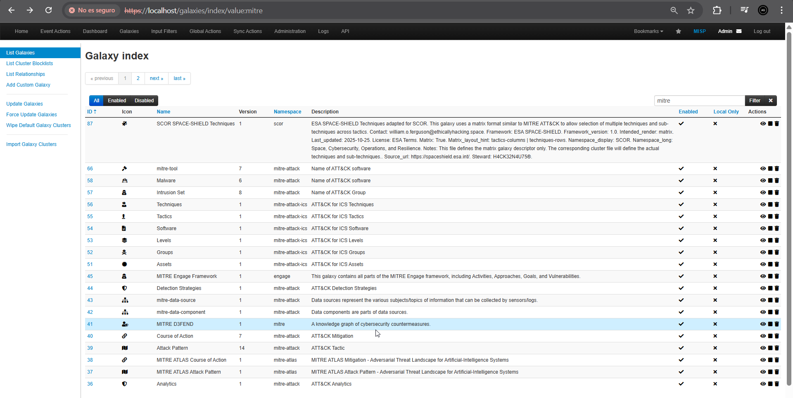 

En la siguiente imagen vemos el ejemplo de la galaxy Attack Patern de mitre attack:

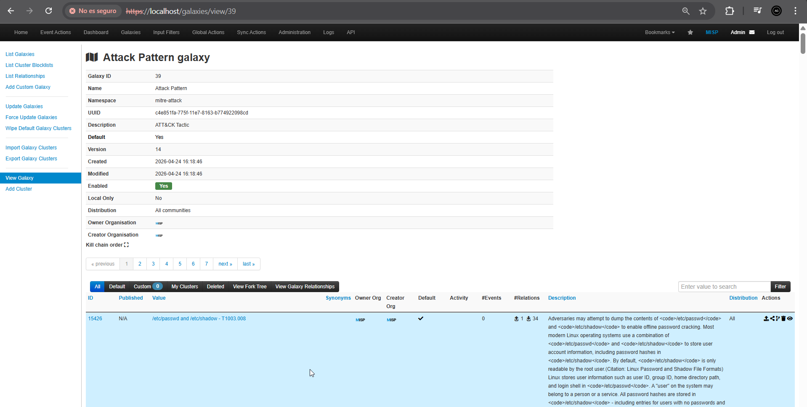

*Ejemplo práctico:* Se asoció la galaxia `mitre-attack-pattern` al evento de prueba para etiquetar las técnicas de ataque empleadas, en este caso asociamos la T1059:

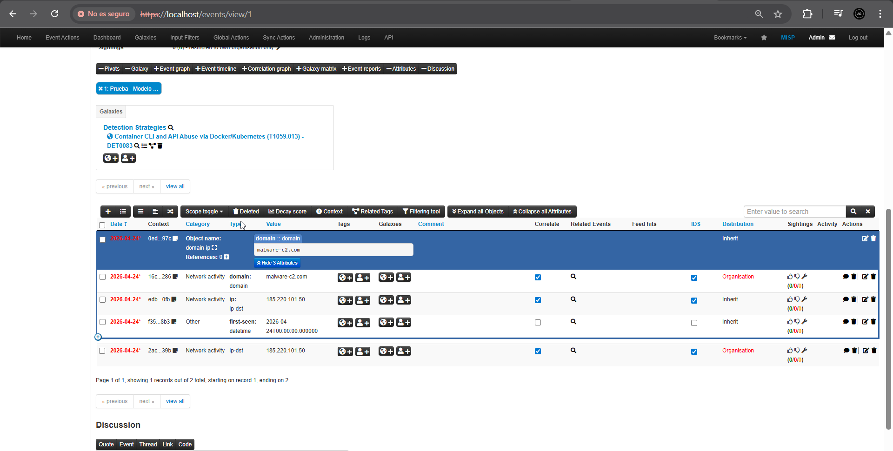

### 4.5 Tag (Etiqueta)

Los **Tags** son etiquetas de texto libre o estructuradas (taxonomías) que se aplican a eventos o atributos para clasificarlos y filtrarlos. Existen taxonomías estandarizadas como:

- `tlp:white / green / amber / red` — Traffic Light Protocol, controla la distribución.
- `type:OSINT` — tipo de fuente de la inteligencia.
- `misp-galaxy:...` — enlace a un cluster de una galaxia.

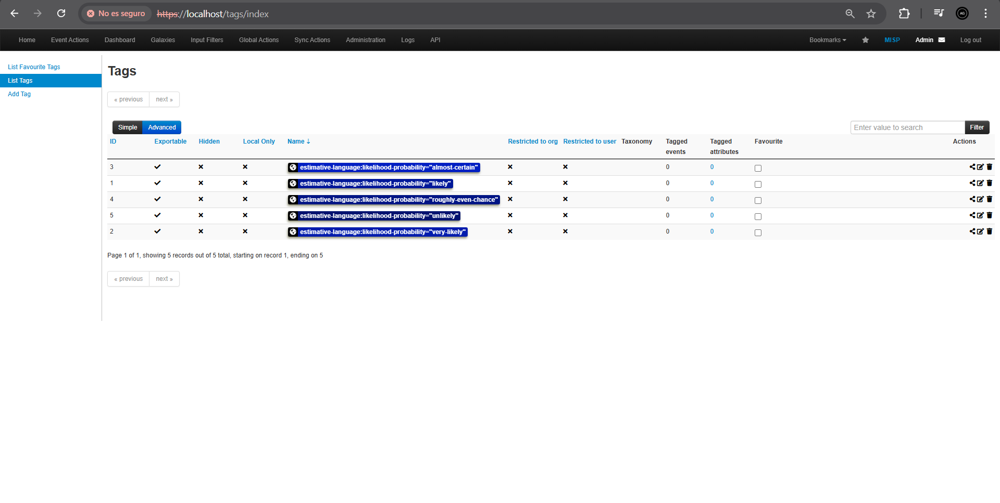

*Ejemplo real observado:* El evento del feed CIRCL (Packrat) tiene los tags `type:OSINT` y `tlp:white`, indicando que es inteligencia de fuente abierta de libre distribución.

### 4.6 Sighting (Avistamiento)

Un **Sighting** registra que un IOC concreto ha sido observado en el entorno de la organización. Esto permite conocer la "vigencia" de los indicadores: si varios analistas de distintas organizaciones reportan el mismo IOC como visto recientemente, aumenta su relevancia operativa.

Los sightings tienen tres tipos: `Sighting` (observado), `False positive` (falso positivo) y `Expiration` (expirado).

### 4.7 ShadowAttribute (Atributo Propuesto)

Un **ShadowAttribute** es una propuesta de atributo realizada por un usuario o instancia externa que aún no ha sido aceptada por el creador del evento. Actúa como mecanismo de revisión colaborativa: otros participantes de la comunidad pueden sugerir IOCs adicionales, que el propietario del evento puede aceptar o rechazar.

***

## 5. Activación del Feed CIRCL OSINT

### 5.1 Habilitación del Feed

Desde **Sync Actions → List Feeds** se habilitó el feed **CIRCL OSINT** (feed oficial de CIRCL, el CSIRT nacional de Luxemburgo y creador de MISP). Este feed publica eventos OSINT de inteligencia de amenazas de fuente abierta de forma continuada.

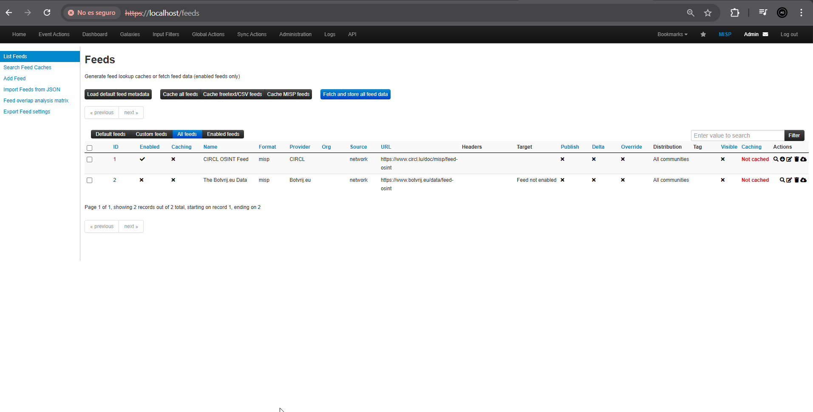

### 5.2 Importación de Eventos

Se lanzó el fetch del feed mediante el botón de descarga. MISP respondió con:

```
Pull queued for background execution.
```

El proceso se ejecutó en segundo plano mediante el sistema de jobs de MISP. Desde **Administration → Jobs** se verificó el progreso: se completaron **72 jobs** de tipo `publish_event` y `publish_alert_email`, confirmando la importación masiva de eventos del feed.

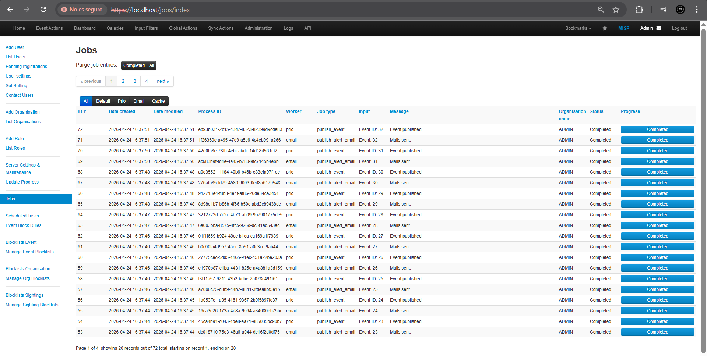

### 5.3 Eventos Importados

Tras la importación, **Event Actions → List Events** mostró los eventos descargados del feed CIRCL. Se analizó en detalle el evento:

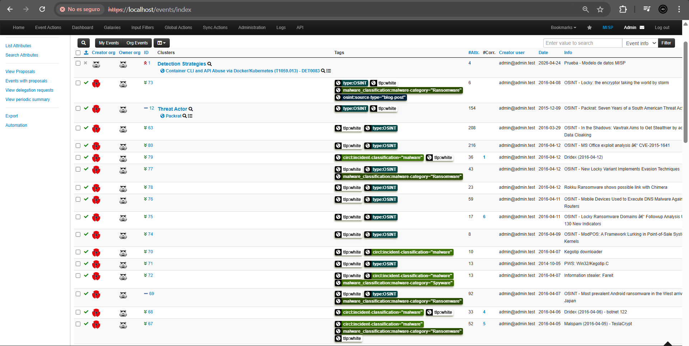

**"OSINT - Packrat: Seven Years of a South American Threat Actor"** (Event ID 12):
- **Fecha:** 2015-12-09
- **Organización:** CIRCL
- **Threat Level:** Medium | **Analysis:** Completed
- **Tags:** `type:OSINT`, `tlp:white`
- **Galaxy:** Threat Actor
- **Atributos:** 154 IOCs distribuidos en:
  - Dominios de phishing: `confirmation-twitter.com`, `confirmation-facebook.com`, `confirmation-outlook.com`, etc.
  - Hashes SHA256 y SHA1 de muestras de malware verificadas en VirusTotal.
  - URLs maliciosas acortadas (TinyURL, bit.ly).
  - Hostnames de infraestructura C2.

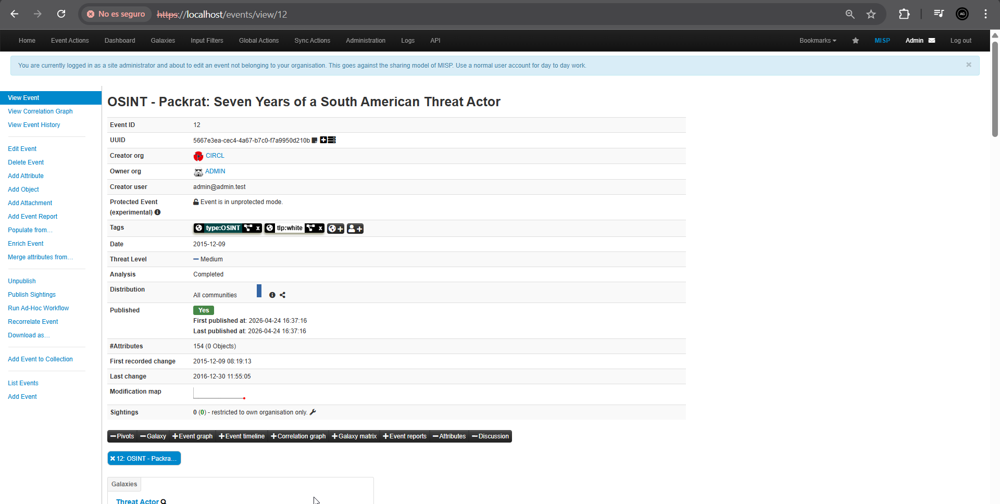

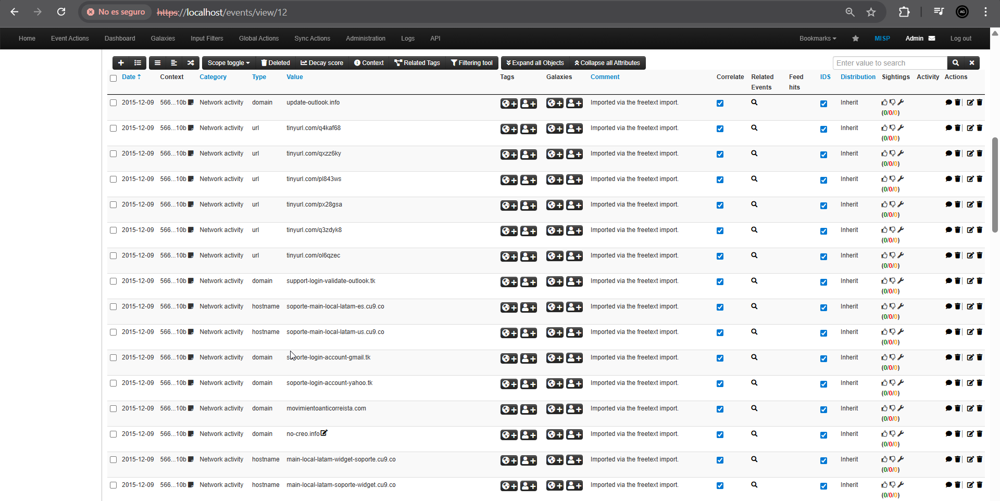

***

## 6. Beneficios Operativos de MISP

El uso de MISP en un entorno SOC/CSIRT aporta ventajas significativas frente a la gestión manual de inteligencia:

| Beneficio | Descripción |
|---|---|
| **Intercambio estandarizado** | Protocolo común (MISP format, STIX/TAXII) que permite compartir IOCs entre organizaciones sin fricciones. |
| **Correlación automática** | MISP detecta automáticamente si un IOC aparece en múltiples eventos, revelando conexiones entre campañas. |
| **Feeds externos integrados** | Ingesta automática de inteligencia pública (CIRCL, Abuse.ch, VirusTotal...) sin desarrollo adicional. |
| **Exportación a herramientas defensivas** | Los atributos con `to_ids=true` se exportan directamente a IDS/IPS (Snort, Suricata), SIEMs y firewalls. |
| **Trazabilidad y auditoría** | Historial completo de cambios, sightings y publicaciones para auditoría de incidentes. |
| **API REST completa** | Automatización total mediante PyMISP o cualquier cliente HTTP, integrando MISP en pipelines de seguridad. |

***

## 7. Automatización con PyMISP

### 7.1 Instalación de PyMISP

PyMISP es la librería oficial en Python para interactuar con la API REST de MISP. Se instaló mediante `pip install pymisp`, lo que permitió conectarse programáticamente a la instancia local de MISP mediante una API Key personal generada desde el perfil del usuario.

```bash
pip install pymisp
```

### 7.2 Obtención de la API Key

Desde el panel de administración de MISP (**Administration → My Profile → Auth Keys**) se generó una nueva clave de autenticación para usarla desde el script de Python. La clave se configuró sin fecha de expiración, sin restricción de IPs y con un comentario identificativo para la práctica.

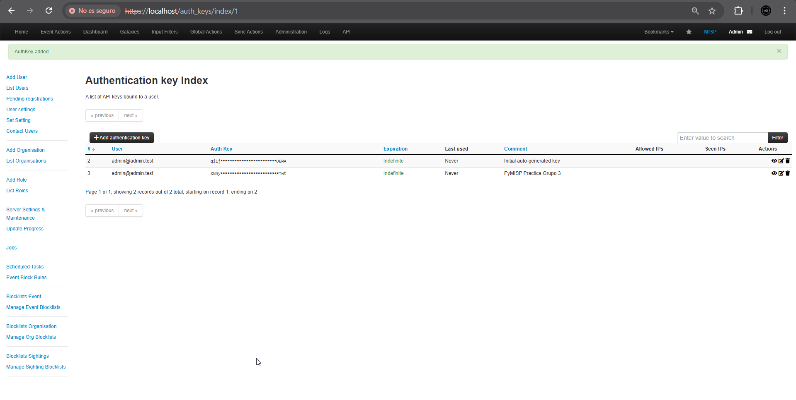

- **Expiration:** Indefinida
- **Allowed IPs:** Sin restricción
- **Comment:** `PyMISP Practica Grupo 3`

> **Nota de seguridad:** La clave completa solo se muestra en el momento de su creación, por lo que en este informe aparece censurada.

### 7.3 Script de automatización

Se desarrolló el script `misp_script.py` para realizar las operaciones solicitadas en la práctica: autenticación, búsqueda de un hash SHA-256 en la instancia y creación de un evento propio con IOCs ficticios marcados con `to_ids=true`. PyMISP permite hacer estas operaciones de forma sencilla mediante objetos Python que encapsulan la API REST de MISP.

```python
from pymisp import PyMISP, MISPEvent

# ── Configuración ──────────────────────────────────────────────
MISP_URL        = "https://localhost"
MISP_KEY        = "**"   # API Key censurada
MISP_VERIFYCERT = False  # Certificado autofirmado en entorno local

# ── a) Autenticación con la API Key ───────────────────────────
misp = PyMISP(MISP_URL, MISP_KEY, MISP_VERIFYCERT)
print("[*] Conexión establecida con MISP")

# ── b) Buscar SHA-256 en toda la instancia ────────────────────
TARGET_HASH = "97af0000000000000000000000000000000000000000000000000000000000c3e"
print(f"\n[*] Buscando hash: {TARGET_HASH}")
result = misp.search(value=TARGET_HASH, type_attribute="sha256")

if not result:
    print("[!] Hash no encontrado en la instancia.")
else:
    for event in result:
        ev = event.get("Event", event)
        print(f"[+] Evento encontrado - ID: {ev.get('id')} | Fecha: {ev.get('date')} | Info: {ev.get('info')}")
        full_event = misp.get_event(ev.get("id"), pythonify=True)
        print("    IPs C2 asociadas:")
        for attr in full_event.attributes:
            if attr.type in ("ip-dst", "ip-src", "domain"):
                print(f"      → {attr.type}: {attr.value} (to_ids={attr.to_ids})")

# ── d) Crear evento propio con IOC inventado (to_ids=True) ────
print("\n[*] Creando evento de prueba con IOC inventado...")
nuevo = MISPEvent()
nuevo.info            = "Ejercicio PyMISP - IOC inventado"
nuevo.distribution    = 0
nuevo.threat_level_id = 2
nuevo.analysis        = 0

nuevo.add_attribute(
    "sha256",
    "aaaa1111bbbb2222cccc3333dddd4444eeee5555ffff6666aaaa7777bbbb8888",
    comment="Hash SHA256 inventado para ejercicio",
    to_ids=True
)

nuevo.add_attribute(
    "ip-dst",
    "192.168.99.1",
    comment="IP C2 ficticia de prueba",
    to_ids=True
)

creado = misp.add_event(nuevo)
print(f"[+] Evento creado con ID: {creado['Event']['id']}")
print(f"    UUID: {creado['Event']['uuid']}")
print("\n[*] Script finalizado correctamente.")
```

### 7.4 Salida obtenida

La ejecución del script produjo una conexión correcta con la instancia local, una búsqueda sin resultados del hash indicado en el enunciado y la creación satisfactoria de un nuevo evento con IOCs ficticios. La salida obtenida fue la siguiente:

```
PS C:\Users\Abel\Desktop\CE Ciberseguridad\Incidentes de Ciberseguridad\MISP\misp-docker> python misp_script.py
... InsecureRequestWarning ...
[*] Conexión establecida con MISP

[*] Buscando hash: 97af0000000000000000000000000000000000000000000000000000000000c3e
[!] Hash no encontrado en la instancia.

[*] Creando evento de prueba con IOC inventado...
[+] Evento creado con ID: 990
    UUID: 5a0b4706-9579-4eb4-b36b-36c8637919f8

[*] Script finalizado correctamente.
[*] Script finalizado correctamente.
```

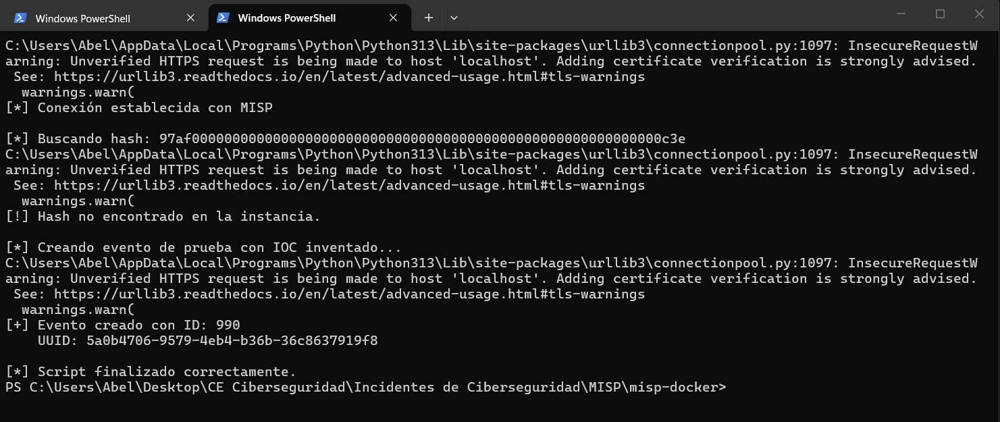

### 7.5 Análisis de resultados

La autenticación con la API se realizó correctamente mediante la API Key generada en MISP, lo que confirma que la instancia local estaba accesible desde Python y que la librería PyMISP quedó correctamente configurada. Los avisos `InsecureRequestWarning` observados durante la ejecución son normales en este contexto, ya que la instancia se estaba sirviendo en `https://localhost` con un certificado autofirmado y la verificación SSL estaba desactivada (`MISP_VERIFYCERT = False`).

La búsqueda del hash SHA-256 `97af…c3e` no devolvió resultados en la instancia. Este comportamiento es válido y debe interpretarse como una ausencia real del indicador en los eventos almacenados localmente, no como un error del script. En un entorno operativo, esta consulta permitiría determinar rápidamente si un hash de fichero sospechoso ya está registrado en la plataforma. 

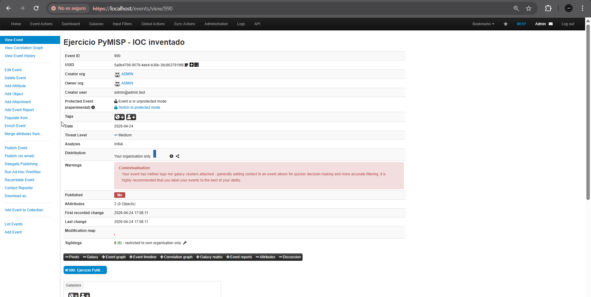

El script sí completó con éxito la creación de un evento nuevo en MISP con ID `990` y UUID `5a0b4706-9579-4eb4-b36b-36c8637919f8`. Este evento contiene dos atributos marcados con `to_ids=True`, lo que indica que ambos IOCs están pensados para ser consumidos por herramientas defensivas y de detección si la plataforma estuviera integrada con el ecosistema de seguridad.

- **SHA256 ficticio:** `aaaa1111bbbb2222cccc3333dddd4444eeee5555ffff6666aaaa7777bbbb8888`
- **IP C2 ficticia:** `192.168.99.1`

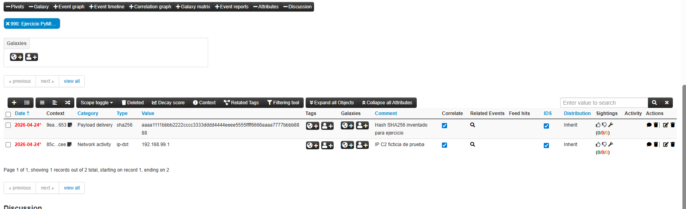

## 8. Conclusiones

La práctica ha permitido desplegar una instancia funcional de MISP, comprender su arquitectura interna y trabajar con su modelo de datos principal en un entorno local. También ha quedado demostrado que MISP no solo sirve como repositorio de IOCs, sino como plataforma de intercambio, contextualización y automatización de inteligencia de amenazas.

La activación del feed CIRCL OSINT permitió poblar la base de datos con eventos reales y comprobar el valor operativo de los feeds externos para enriquecer una plataforma CTI sin necesidad de introducir manualmente toda la información. El análisis del evento Packrat mostró cómo MISP combina atributos técnicos, etiquetas y galaxias para aportar contexto accionable al analista. 

Por último, la automatización con PyMISP confirmó que la API REST de MISP puede integrarse fácilmente en scripts y flujos de trabajo de un SOC. La búsqueda de IOCs y la creación automática de eventos constituyen casos de uso realistas para enriquecer alertas, apoyar la respuesta ante incidentes y alimentar herramientas de detección con nuevos indicadores de forma programática.
